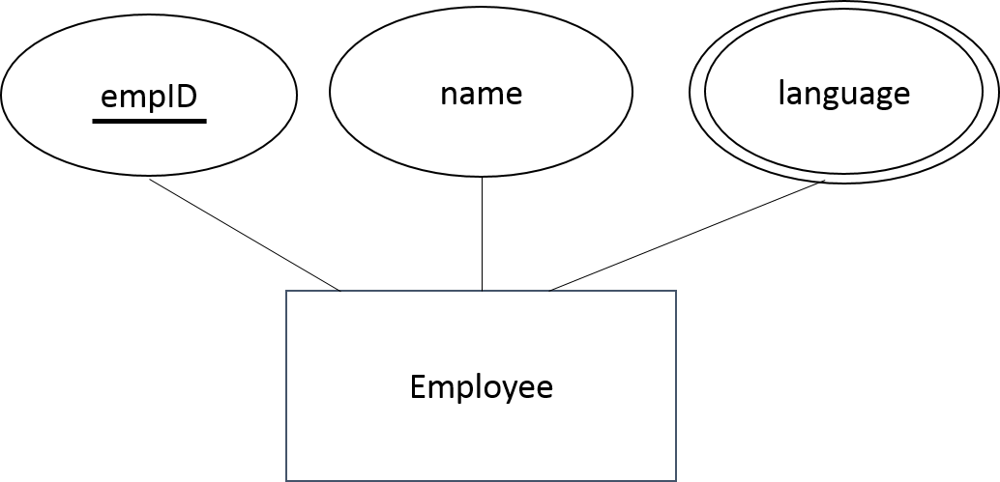
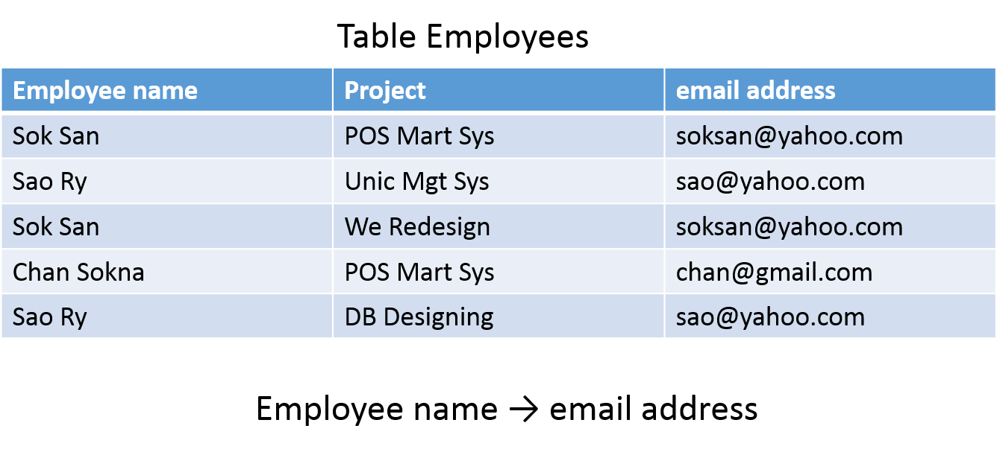
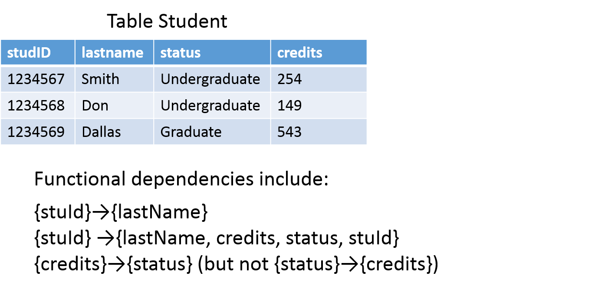
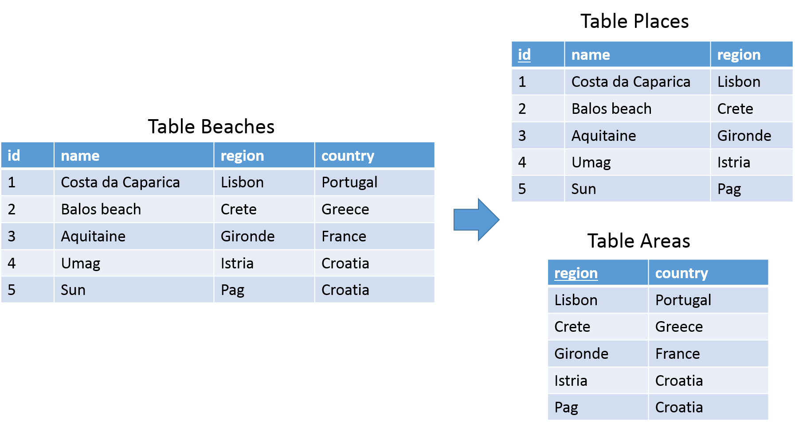
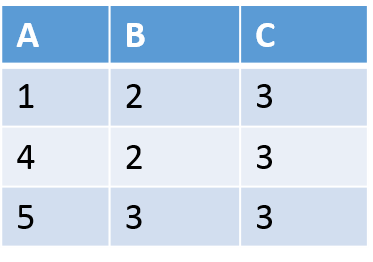
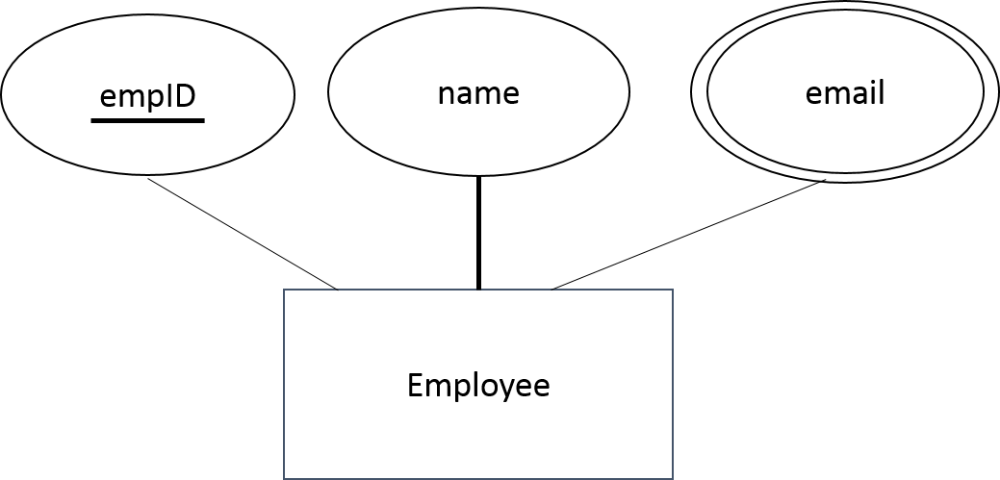

# **BOOTCAMP FULLSTACK**

## Fullstack FT Vitoria Abril 2025

---
# Normalización de Bases de Datos

## Antecedentes y Terminología
- ¿Qué es una base de datos relacional?
- ¿Qué es una clave primaria?
- ¿Qué es una clave foránea?

## Sistema de Gestión de Bases de Datos Relacionales (RDBMS)
- Colección de información organizada en tablas  
  - Las tablas también se denominan relaciones
- Las tablas se construyen y se asocian entre sí mediante campos compartidos — campos “comunes”
  - Los campos también se conocen como “columnas” o “atributos”
- Un conjunto de atributos forma un registro
  - Los registros también se denominan “filas” o “tuplas”
- Las tablas se relacionan mediante campos comunes designados como claves primarias y foráneas
- Permite actualizar y eliminar datos garantizando su precisión

## Campos de Clave Primaria y Clave Foránea
- **Clave primaria**
  - Debe ser única y no puede contener valores nulos
  - Cada tabla debe tener una clave primaria
  - Claves concatenadas: uso de más de un campo como clave primaria

- **Clave foránea**
  - Campo que se refiere a la clave primaria en otra tabla
  - Los datos deben coincidir exactamente con los de la clave referida

## Modelo de Base de Datos Relacional
- Principios básicos:
  - Agrupar atributos de una entidad
  - Crear tablas para los tipos de entidades
  - Relacionar tablas como en el diagrama E-R
- Preguntas clave:
  - ¿Qué atributos deben agruparse?
  - ¿Existe una mejor combinación que mejore la flexibilidad y fiabilidad?
- Reglas básicas del diseño de base de datos

## Anomalías en Bases de Datos
- **Anomalía de actualización**: 
  - Datos inconsistentes al no actualizar todas las copias de un dato.
- **Anomalía de eliminación**: 
  - Eliminar datos sin querer al eliminar una fila.
- **Anomalía de inserción**: 
  - No se puede insertar cierta información si otra relacionada no existe aún.

> La normalización ayuda a eliminar estas anomalías y mantiene la base de datos consistente.

## ¿Qué es la Normalización?
- Proceso para organizar datos con el objetivo de:
  - Eliminar redundancia
  - Almacenar datos en la tabla correcta
  - Evitar reestructuración al añadir datos
- Existen 5 formas normales (NF), cada una requiere cumplir con la anterior
- La tercera forma normal (3NF) es suficiente para la mayoría de aplicaciones

## Problemas sin Normalización
- Dificultades para manejar y actualizar la base de datos
- Anomalías frecuentes de inserción, actualización y eliminación


### Anomalía de Inserción
- Si el estudiante aún no selecciona materias, se deben insertar valores nulos → anomalía

### Anomalía de Actualización
- Un cambio de dirección requiere modificar múltiples filas → si se omite alguna, hay inconsistencias

### Anomalía de Eliminación
- Eliminar una fila puede eliminar datos importantes como el registro completo de un estudiante

## Visión General de la Normalización
- Organiza los datos para evitar:
  - Redundancia
  - Inserción anómala
  - Actualización anómala
  - Eliminación anómala
- Formas normales más comunes:
  - 1NF
  - 2NF
  - 3NF

---

## Primera Forma Normal (1NF)
- Una columna no puede contener múltiples valores
- Cada celda debe contener **valores atómicos**

  


### Problemas sin 1NF
- SELECT, INSERT, DELETE, UPDATE pueden fallar o volverse complicados

#### Ejemplo de fallo en SELECT:
```sql
SELECT *
FROM employee
WHERE language = 'English'
```
Solución:
```sql
SELECT *
FROM employee
WHERE language LIKE '%English%'
```

#### Ejemplo de fallo en UPDATE:
```sql
UPDATE employee
SET language = 'French, English'
WHERE name = 'George'
```


### Alternativa: relación muchos-a-muchos


### En resumen
- Sin valores duplicados
- Valores atómicos
- Registros únicos


---

## Dependencias Funcionales
- Una dependencia funcional es una relación entre atributos:
  - Si A determina B → se escribe: `A → B`
- Ejemplos:
  - `CódigoPostal → Ciudad`
  - `NombreArtista → AñoNacimiento`
  - `Autor, Título → FechaPublicación`

### Tipos de dependencia:
- **Total**: si al quitar un atributo, la dependencia ya no se cumple
- **Parcial**: un atributo no clave depende de parte de la clave primaria

  
  


---

## Segunda Forma Normal (2NF)
- Requisitos:
  - Estar en 1NF
  - Todos los atributos no clave deben depender completamente de la clave primaria

### Ejemplo:
- Clave compuesta: `{Título, Actor}`
- Si `Título → Director`, entonces hay dependencia parcial

  
  


### Otro ejemplo:
- `{Fabricante, Modelo} → PaísFabricante`

  


---

## Tercera Forma Normal (3NF)
- Requisitos:
  - Estar en 2NF
  - Ningún atributo no clave debe depender de otro atributo no clave

### Proceso de descomposición:
- Si `Región → País`, se crea una nueva tabla:  
  Tabla 1: original sin 'País'  
  Tabla 2: {Región, País}

  


---

## Razones para No Normalizar
- Las consultas con múltiples JOIN pueden ser lentas
- El diseño normalizado puede ser complejo
- Para prototipos rápidos, puede ser más práctico no normalizar

---

## Ejercicios

### Ejercicio 1
Considera la siguiente tabla:  


**¿Cuál de las siguientes dependencias funcionales NO es correcta?**
- a) A → B
- b) B → C
- c) BC → A
- d) AC → B

---

### Ejercicio 2
Considera la siguiente tabla:  


**¿Qué dependencias funcionales se cumplen?**
- a) XY → Z, Z → Y
- b) XZ → X, Y → Z
- c) YZ → X, X → Z
- d) XZ → Y, Y → X

---

### Ejercicio 3
**¿Cuál es el esquema de base de datos para el siguiente diagrama E-R?**  
Cada empleado puede tener hasta dos correos electrónicos  


---

### Ejercicio 4
**Convierte la siguiente tabla a Primera Forma Normal:**  


---

### Ejercicio 5
**Convierte la siguiente tabla a Tercera Forma Normal:**  


---

### Ejercicio 6
**Convierte la siguiente tabla a Segunda Forma Normal:**  

